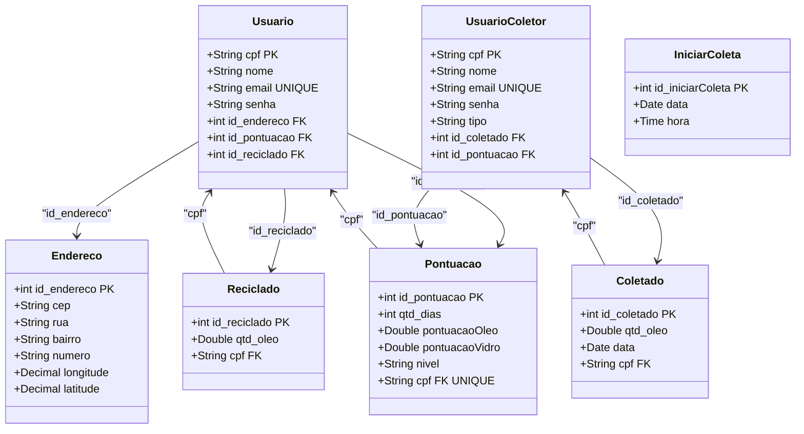
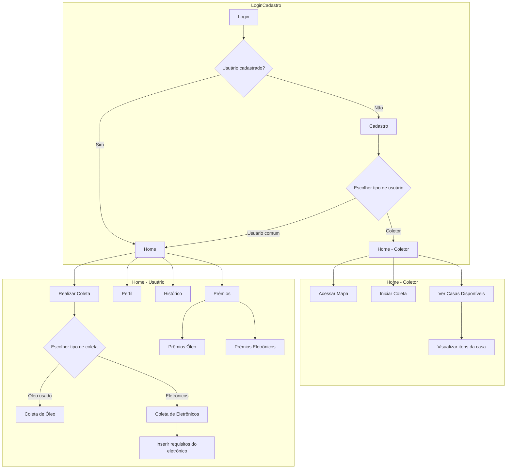
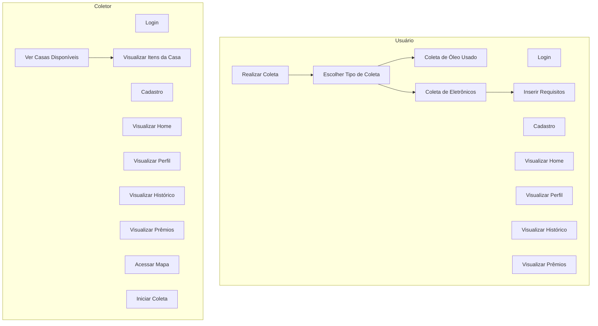

<br>
<br>
<br>
<p align="center">
   
</p>

<p align="center">
   
   
   
   
</p>
<hr>
<br>
<br><br><br>


</a>

- [Contexto Inicial](#contexto-inicial)
- [Problema Encontrado](#problema-encontrado)
- [Nossa Solução](#nossa-solução)
- [Protótipos](#protótipos)
- [Diagramas](#diagramas)
- [Funcionalidades do Aplicativo](#funcionalidades-do-aplicativo)
- [Ferramentas de Desenvolvimento](#ferramentas-de-desenvolvimento)
- [Referências](#referências)
- [Equipe de Desenvolvimento](#equipe-de-desenvolvimento)
<br><br><br>

</a>
## Apresentação do Projeto: Desenvolvimento de Aplicativo sobre Coleta Seletiva de Óleo

### Contexto Inicial
A crescente produção de resíduos é um reflexo do aumento da urbanização e do consumo em larga escala, gerando desafios significativos para a gestão ambiental. Entre os resíduos mais prejudiciais ao meio ambiente está o óleo de cozinha usado, um recurso amplamente descartado de forma inadequada por residências, comércios e até indústrias. Estima-se que apenas um litro de óleo descartado incorretamente seja capaz de contaminar milhares de litros de água potável, gerando prejuízos irreversíveis para a fauna e flora aquática, além de danificar tubulações, sistemas de esgoto e estações de tratamento de água.

Quando descartado no lixo comum ou na rede de esgoto, o óleo não apenas contribui para o entupimento de sistemas de drenagem urbana, como também forma uma película sobre os cursos d'água que dificulta a entrada de oxigênio, essencial para a sobrevivência de organismos aquáticos. Esses impactos ambientais afetam diretamente a qualidade de vida, a sustentabilidade dos recursos naturais e a saúde pública.

Apesar de existirem iniciativas voltadas à reciclagem de óleo, como a transformação em biocombustível ou sabão, grande parte da população desconhece esses processos e não tem acesso às informações ou ferramentas necessárias para colaborar com a coleta seletiva. Além disso, a falta de incentivos práticos e de pontos de coleta acessíveis torna difícil a adesão à reciclagem de forma significativa.

Dessa forma, torna-se evidente a necessidade de uma solução integrada e prática que eduque, engaje e facilite o processo de coleta e descarte correto do óleo usado. Esse cenário abriu caminho para o desenvolvimento de um aplicativo inovador que busca preencher essas lacunas, promovendo a conscientização ambiental, a logística simplificada e a valorização do impacto positivo que cada cidadão pode gerar ao adotar práticas sustentáveis.

<br><br><br>

</a>
## Problema Encontrado
O descarte inadequado do óleo de cozinha usado continua sendo uma prática alarmantemente comum, impulsionada por uma combinação de falta de informação, barreiras logísticas e ausência de estímulos efetivos. Esse problema persiste apesar do impacto ambiental significativo que essa prática acarreta, prejudicando ecossistemas, infraestrutura urbana e a saúde pública. Entre os principais desafios identificados estão:

   - **Falta de conscientização e educação ambiental**: Muitos consumidores não compreendem a gravidade dos impactos ambientais do descarte incorreto. Informações sobre os danos causados à água, ao solo e à biodiversidade, bem como os benefícios de práticas sustentáveis, ainda não chegam de forma eficaz à população em geral.
   - **Dificuldade no armazenamento e separação do óleo usado**: A ausência de orientações claras sobre como armazenar o óleo de forma segura e higiênica dificulta a participação ativa da população no processo de reciclagem. Muitos desconhecem materiais adequados para o armazenamento ou têm dúvidas sobre os procedimentos corretos.
   - **Falta de pontos de coleta acessíveis e estruturados**: Em muitas localidades, não há uma rede eficiente de pontos de descarte ou coleta seletiva para óleo usado. A distância e a dificuldade de localizar esses locais desmotivam o público a separar e entregar o óleo corretamente.
   - **Baixa visibilidade de programas e incentivos**: Iniciativas como recompensas por reciclagem, descontos ou benefícios em troca de resíduos ainda são pouco divulgadas ou inexistentes em várias regiões. Essa lacuna reduz o engajamento das pessoas, que muitas vezes não veem um retorno prático ou imediato em adotar essas práticas.
   - **Infraestrutura urbana inadequada**: Além da falta de pontos de coleta, as redes de esgoto frequentemente sofrem com entupimentos causados pelo descarte inadequado de óleo, gerando custos elevados de manutenção para cidades e contribuindo para enchentes e alagamentos.

Esses fatores combinados resultam em um ciclo prejudicial no qual toneladas de óleo de cozinha usado são descartadas diretamente no ambiente, contaminando solos, rios e lagos. Isso agrava problemas ecológicos, como a poluição hídrica, e sociais, como a falta de água limpa, além de sobrecarregar sistemas de tratamento e dificultar iniciativas de recuperação ambiental. Essa realidade evidencia a necessidade de soluções que facilitem o acesso à informação, tornem o processo de descarte mais simples e recompensem o engajamento sustentável da população.
<br><br><br>


</a>
## Nossa Solução
O projeto propõe o desenvolvimento de um aplicativo inovador focado na **coleta seletiva de óleo**, com o objetivo de educar, facilitar e incentivar a reciclagem do óleo de cozinha usado. Nossa solução busca transformar um problema ambiental em uma oportunidade de engajamento sustentável, oferecendo ferramentas práticas e educativas que conectam tecnologia, gamificação e responsabilidade social. As principais funcionalidades do aplicativo incluem:

### 1. Mapa de Pontos de Coleta: 
   - **Localização em Tempo Real**: Um mapa interativo que exibe os pontos de coleta mais próximos, com detalhes como endereço, horários de funcionamento e capacidade de armazenamento.
   - **Rotas Facilitadas**: Integração com sistemas de navegação para traçar rotas rápidas e eficientes até os pontos de coleta.
   - **Alertas e Notificações**: Lembretes personalizados para avisar os usuários sobre a necessidade de esvaziar os recipientes de óleo armazenado.

### 2. Sistema de Gamificação e Recompensas:
   - **Ranking de Usuários**: Um sistema de pontuação baseado na quantidade de óleo reciclado, incentivando uma competição saudável entre os participantes.
   - **Prêmios Sustentáveis**: Recompensas como vale-presentes, descontos em produtos ecológicos e kits sustentáveis para os usuários mais engajados.
   - **Medalhas e Troféus Virtuais**: Reconhecimentos para quem atingir marcos importantes na reciclagem, promovendo um senso de conquista e pertencimento.

### 3. Facilidade na Comunicação:
   - **Plataforma de Parcerias**: Espaço para cooperativas e recicladores divulgarem seus serviços e expandirem suas redes de coleta.
   - **Benefícios para a Comunidade**: Criação de um ecossistema que promove a economia circular, gerando renda e oportunidades locais.
   - **Feedback em Tempo Real**: Canal para que os usuários possam relatar experiências e sugerir melhorias para os serviços de reciclagem.

     
### 4. Impacto Social e Ambiental:
   - **Redução da Poluição Hídrica**: Ajudando a evitar que o óleo seja despejado nos ralos e cause danos ao ecossistema aquático.
   - **Estímulo a Hábitos Sustentáveis**: Educando as gerações atuais e futuras sobre a importância da reciclagem no cuidado com o planeta.
   - **Engajamento Comunitário**: Incentivando um movimento coletivo em prol da preservação ambiental, unindo indivíduos, empresas e organizações.

## Diferencial do Projeto
Nosso aplicativo se destaca por integrar tecnologia e gamificação de forma acessível e envolvente. Ele transforma a reciclagem de óleo em uma atividade prática e divertida, promovendo não apenas a redução dos impactos ambientais, mas também recompensando os esforços dos usuários.

Por meio dessa solução, buscamos transformar o descarte do óleo usado em um ato de impacto positivo, contribuindo para a preservação ambiental e incentivando a construção de uma sociedade mais consciente e sustentável.
<br><br><br>

</a>
## Protótipos
O processo de prototipagem do nosso aplicativo foi realizado utilizando a ferramenta Figma, que nos permitiu desenvolver wireframes de alta fidelidade para todas as interfaces principais. O objetivo foi criar uma experiência visualmente atraente e intuitiva, tanto para o usuário comum (aquele que recicla o óleo usado) quanto para o coletor (responsável por recolher o óleo nos pontos de entrega).

**Screens do Usuário:** <br>
As telas projetadas para o usuário foram pensadas para garantir facilidade no uso e acessibilidade, promovendo uma navegação simples e funcional. Algumas das funcionalidades principais representadas nos protótipos incluem:

**Tela Inicial**: Exibição dos óleos que o usuário registrou no aplicativo e botão de redirecionamento para registro de óleo. <br><br>
**Perfil e Histórico**: Registro de todas as entregas realizadas, pontuação acumulada e conquistas desbloqueadas. <br><br>
**Sistema de Gamificação**: Exibição de rankings e prêmios disponíveis, incentivando a reciclagem de forma divertida e motivadora. <br><br>
<div align="center">
    
</div> <br><br>

**Screens do Coletor:** <br>
Para os coletores, as telas foram projetadas com foco na logística e na eficiência do trabalho de coleta. O layout prioriza funcionalidades que simplificam a comunicação com os usuários e a gestão dos pontos de coleta. Entre as principais telas destacam-se:

**Rotas Otimizadas**: Ferramenta para planejar trajetos eficientes entre os locais de coleta. <br> <br>
**Histórico de Coletas**: Registro das operações realizadas, com métricas sobre quantidade de óleo coletado e impacto ambiental gerado.
<div align="center">
    
</div>
<br><br><br>

</a>
## Diagramas

### Diagrama de Classe:

<br><br>
### Diagrama de Fluxo

<br><br>
### Diagrama de Uso:


<br><br><br>

</a>
## Funcionalidades do Aplicativo
<details>

<summary> Cadastro de Usuário </summary>

# Cadastro de Novo Usuário

Esta funcionalidade permite cadastrar novos usuários no sistema com informações adicionais como nome e CPF. A implementação inclui validação de campos na interface do usuário e tratamento de erros durante a criação do usuário e o armazenamento de dados no Firebase.

---

## Validação de Campos

Antes de enviar os dados, é realizada uma validação para garantir que todos os campos obrigatórios estejam preenchidos corretamente. 

### Validações Implementadas
1. **Nome:** Não pode estar vazio.
2. **Email:** Não pode estar vazio e deve ser um formato válido.
3. **Senha:** Deve conter pelo menos 6 caracteres.
4. **Confirmação de Senha:** Deve corresponder à senha informada.
5. **CPF:** Não pode estar vazio e deve existir.

Caso algum campo não seja válido, uma mensagem de erro é exibida, orientando o usuário a corrigir o problema.

---

## Tratamento de Erros com `try-catch`

A lógica de cadastro utiliza um bloco `try-catch` para tratar erros durante o processo de registro. Isso garante que, caso ocorra uma falha, o sistema não trave e o erro possa ser identificado e exibido.

### Fluxo no Bloco `try`
1. **Criação do Usuário:** Os dados de autenticação são enviados ao Firebase Authentication.
2. **Armazenamento no Firestore:** Após a criação bem-sucedida do usuário, as informações adicionais (nome, CPF, email, data de criação) são salvas no Firestore.

### No Bloco `catch`
- Caso ocorra um erro em qualquer etapa (autenticação ou armazenamento), o erro é capturado e registrado no console para depuração.
- Um retorno `null` é enviado para indicar falha no processo.
- FirebaseAuthException: Erros relacionados ao Firebase Authentication, como email já cadastrado ou senha inválida.
- FirestoreException: Erros relacionados ao armazenamento de dados no Firestore.
- Outros Erros Genéricos: Erros inesperados são tratados e registrados para análise.

</details>


<details>

<summary> Login </summary>

# Login
Este código implementa a funcionalidade de login com Firebase Authentication e Firestore. Além disso, determina a página para onde o usuário será redirecionado após o login.

1. Entrada de Dados: 
O usuário fornece email e senha nos campos correspondentes.

2. Validação: 
Os campos de entrada possuem validação para garantir que não estejam vazios.

3. Autenticação:
O método _authService.signInWithEmail realiza a autenticação com Firebase Authentication.

Caso o login seja bem-sucedido, o objeto User contendo informações do usuário autenticado é retornado.

- Caso o campo imagem do firestore do usuário esteja vazio ou seja null, o usuário é redirecionado para a página de configuração de ícone (SetIconScreen). Isso força o usuário a selecionar um ícone antes de acessar outras funcionalidades.
- Caso o campo imagem tenha um valor válido, o usuário é redirecionado diretamente para a página inicial (HomePage)

**Outros Pontos:**
1. CustomTextField:
Um componente reutilizável para campos de entrada com validação e personalização visual.

2. GradientButton:
Um botão com estilo de gradiente e bordas arredondadas, reutilizável em diferentes telas.

</details>


<details>

<summary> Seleção de Ícone </summary>

# Tela de Ícones
O código implementa a funcionalidade de permitir que o usuário selecione um ícone e salve essa escolha no banco de dados Firestore, com as seguintes etapas:

1. Exibição das Opções de Ícones:
Uma lista de URLs é usada para exibir os ícones disponíveis.
O índice do ícone selecionado é armazenado na variável selectedIndex.

2. Quando o usuário clica em um ícone, o evento onTap é disparado.
A seleção atualiza o estado (setState) para destacar o ícone escolhido.

3. O botão "Confirmar Seleção" só é habilitado se selectedIndex não for null, garantindo que o usuário escolha um ícone antes de prosseguir.

4. Ao confirmar a escolha, o código usa a coleção users no Firestore.
A imagem escolhida é atualizada no documento do usuário identificado por userId.

```dart
await FirebaseFirestore.instance
    .collection('users')
    .doc(widget.userId)
    .update({'imagem': imageUrls[selectedIndex!]});
```

**Pontos Importantes**
1. Validação e Estado:
O botão de confirmação fica desabilitado (null) até que uma escolha válida seja feita.
2. Firebase:
A atualização no Firestore é feita de forma assíncrona(async), garantindo que a operação seja concluída antes de navegar para a próxima tela.

</details>


<details>

<summary> Cadastro de Endereço </summary>

# Cadastro de Endereço
O código a seguir é da página onde o usuário pode cadastrar um endereço, utilizando o `CEP` para buscar informações como rua e bairro através da `API ViaCEP`. Após o preenchimento, os dados são salvos no Firestore na subcoleção endereco dentro do documento do usuário autenticado no Firebase Authentication.

1. Busca pelo CEP:
Utiliza a API ViaCEP para buscar endereço pelo CEP fornecido.
Preenche automaticamente os campos "Rua" e "Bairro".

2. Validação de Campos:
Valida se os campos estão preenchidos corretamente (CEP com 8 dígitos, rua, bairro e número não vazios).

3. Salvar no Firestore:
Salva os dados do endereço na subcoleção endereco do usuário autenticado.

4. Mensagens de Erro e Sucesso:
Exibe mensagens claras de erro (como CEP inválido ou falha na conexão) e confirmações de sucesso após salvar.

</details>


<details>

<summary> Cadastro de Itens </summary>

# Cadastro de óleo no aplicativo
A funcionalidade de cadastro de óleo permite que usuários registrem a quantidade de óleo reciclado no sistema. Além disso, ela verifica se o usuário possui um endereço cadastrado antes de concluir a operação. Caso não tenha, um diálogo é exibido para orientar o usuário a cadastrar um endereço.
<br><br>
## Fluxo da Funcionalidade:
<br>

### 1. Incremento/Decremento da Quantidade de Óleo:
   - O usuário pode ajustar a quantidade de óleo a ser reciclado em incrementos ou decrementos de 500ml.
<br>

### 2. Verificação de Endereço:
   - Antes de registrar o óleo reciclado, o sistema verifica se o usuário possui um endereço cadastrado.
     
   - Caso não haja um endereço cadastrado, um diálogo é exibido com duas opções:
     
     - **Cadastrar Endereço**: Redireciona para a página de cadastro de endereço.
     - **Voltar**: Fecha o diálogo, permitindo que o usuário volte à tela anterior.
<br>

### 3. Registro dos Dados:
   - Os dados são armazenados na subcoleção reciclado no Firestore, com as seguintes informações:
     - Quantidade de óleo reciclado (**qtd**)
     - Tipo de óleo reciclado (**tipo**)
     - Data e hora do registro (**timestamp**)
     - Status do registro (**status**)
   - Após o registro, o ID do documento gerado automaticamente é adicionado ao próprio documento.
<br>

### 4. Feedback ao Usuário:
   - Em caso de sucesso, é exibida uma mensagem de confirmação via **SnackBar** e o usuário é redirecionado para a tela inicial.
   - Em caso de erro, uma mensagem apropriada é exibida ao usuário.
<br><br>

## Estrutura do Código

### Classe: OilRegisterControllers
Responsável por gerenciar a lógica do registro de óleo reciclado.

### Métodos Principais:
#### 1. increment()
   - **Descrição**: Incrementa a quantidade de óleo reciclado em 500ml.
   - **Retorno**: Atualiza a variável _oilAmount.

#### 2. decrement()
   - **Descrição**: Decrementa a quantidade de óleo reciclado em 500ml, garantindo que o valor não fique negativo.
   - **Retorno**: Atualiza a variável _oilAmount.

#### 3. getOilAmount()
   - **Descrição**: Retorna a quantidade atual de óleo reciclado.
   - **Retorno**: Inteiro representando a quantidade em mililitros.


</details>

<details>

<summary> Traçar Rotas </summary>

# Traço de rotas no aplicativo com Google Maps
A funcionalidade de traço de rotas permite que o coletor identifique os pontos de coleta que estão mais próximos dele com base na sua localização atual. Além disso, ela insere abaixo do mapa algumas informações dos usuários do qual o coletor está indo buscar o óleo em formato de cards.


<br><br>
## Fluxo da Funcionalidade:
<br>

### 1. Exibição:
   - Exibir locais de interesse (como endereços de reciclagem) em um mapa interativo.
<br>

### 2. Rotas:
   - Traçar rotas entre os pontos utilizando a API de Direções do Google Maps.
     
   - Mostrar a distância total da rota calculada.

   - Indicar locais mais próximos do usuário com base em sua localização atual.
<br><br>

## Principais recursos:

**Google Maps Directions API:** Para traçar rotas e calcular distâncias. <br>
**Geolocator**: Para obter a localização atual do dispositivo. <br>
**Flutter Map**: Para renderizar o mapa interativo e mostrar pontos/rotas. <br>
**Cloud Firestore**: Para buscar locais (endereços) salvos no banco de dados. <br>
**Geocoding API**: Para converter endereços em coordenadas geográficas (latitude e longitude). <br>
<br><br>

## Estrutura do Código

### 1. Permissões de Localização
   - O método **_checkLocationPermission** solicita permissões ao usuário para acessar sua localização, verificando também se o serviço de localização está ativo no dispositivo.

### 2. Localização Atual do Usuário
   - O método **_updateLocations** atualiza a posição atual no mapa e a adiciona à lista de locais monitorados.
   - A localização é obtida dinamicamente através do Geolocator.

### 3. Carregamento de Locais do Firestore
   - O método **_loadLocationsAndRoutes** busca dados de locais de reciclagem armazenados no Firestore:
      - Dados de endereço são convertidos em coordenadas geográficas usando a API de Geocodificação.
      - Os locais são adicionados a uma lista para serem exibidos no mapa.

### 4. Traçar Rotas no Google Maps
   - O método **_fetchRoutePointsForAllLocations** faz requisições à API de Direções do Google Maps para traçar rotas entre os pontos:
      - Ponto de origem: Localização atual ou primeiro ponto na lista.
      - Destino: Último ponto na lista.
      - Pontos intermediários: Locais no meio da lista.
      - O polígono (rota) é decodificado e desenhado no mapa usando PolylineLayer.

### 5. Cálculo de Distância Total
   - O método **_calculateDistance** utiliza a fórmula de Haversine para calcular a distância entre dois pontos de latitude/longitude.
   - O total das distâncias entre os pontos consecutivos é calculado.
</details>


<details>

<summary> Ranking </summary>

# Sistema de Pontuação e Ranking
O sistema de ranking é responsável por organizar e exibir os usuários de acordo com sua pontuação de experiência (XP), obtida através de atividades concluídas relacionadas à reciclagem. A funcionalidade inclui:
   - Identificação e ordenação dos usuários com base no XP acumulado.
   - Destaque visual para os três primeiros colocados (pódio).
   - Exibição de prêmios para os melhores colocados, incentivando o engajamento.
<br><br>
## Fluxo da Funcionalidade:
<br>

### 1. Carregamento dos Dados
   - Os dados dos usuários são extraídos da coleção users no **Firebase Firestore**.
   - Para cada usuário, é feita a soma do XP de atividades concluídas presentes na subcoleção reciclado.
   - Usuários são ordenados em ordem decrescente de XP.
<br>

### 2. Exibição no Ranking
   - **Top 3**: Os três primeiros usuários são exibidos em destaque no formato de um pódio.
   - **Resto do Ranking**: Demais usuários aparecem em uma lista organizada e estilizada.
   - Dados apresentados: Nome do usuário, foto de perfil e quantidade de XP.
<br>

### 3. Navegação:
   - O ranking faz parte de um sistema de abas controlado por uma barra de navegação inferior.
   - Ao trocar de aba, a página correspondente é exibida.
<br>

### 4. Botão "Mais Informações"
   - Exibe um diálogo modal com detalhes dos prêmios oferecidos para os cinco primeiros colocados.
<br><br>

## Estrutura do Código

### 1. Classe Principal
**Classe**: RankingPage <br>
**Estado**: _RankingPageState <br>
Controla a inicialização, carregamento e organização dos dados para o ranking.

## 2. Carregamento dos Dados
**Método**: fetchUserXpData() <br>
Responsabilidade: Busca os dados no **Firestore**, calcula o XP acumulado e ordena os usuários por pontuação.

## 3. Construção da Interface
**Método Principal**: build(BuildContext context) <br>
Usa um FutureBuilder para aguardar os dados de XP. <br>
Exibe as seções: pódio e lista de usuários restantes.

## 4. Destaque dos Três Primeiros
**Método**: _buildTopThreeSection() <br>
Monta o pódio com estilos diferenciados para os três primeiros colocados.

## 5. Lista dos Demais Usuários
**Método**: _buildRemainingRanking() <br>
Renderiza os usuários do 4º lugar em diante, com informações em um estilo de lista personalizada.

## 6. Diálogo de Prêmios
**Método**: _showRewardsDialog() <br>
Apresenta uma mensagem animada com os prêmios para os 5 melhores.
</details>
<br><br><br>

</a>
## Ferramentas de Desenvolvimento
 <p>  
      
  <table>
  <thead>
    <tr>
      <th> Linguagens </th>
      <th> Frameworks </th>
      <th> Outros </th>
    </tr>
  </thead>
  <tbody>
    <tr>
      <td align="center">  </td>
       <td align="center">  </td>
        <td align="center">  </td>
    </tr>
     <tr>
         <td align="center"> </td>
         <td align="center">  </td>
         <td align="center">  </td>
      </tr>
    <tr>
      <td align="center"> </td>
        <td align="center"> </td>
        <td align="center">  </td>
    </tr>
    <tr>
      <td align="center">  </td>
      <td align="center"> </td>
       <td align="center">  </td>
    </tr>
  </tbody>
</table>
   </p>
</p>
<br><br><br>

</a>
## Referências

* ### Fontes de Pesquisa para Desenvolvimento do Problema:
    - [G1 - Notícia sobre acúmulo de lixo e mato alto na praça de Limeira](https://g1.globo.com/sp/piracicaba-regiao/noticia/2023/12/25/sem-manutencao-praca-de-limeira-tem-mato-alto-acumulo-de-lixo-e-gera-transtornos-a-moradores.ghtml)
    - [Prefeitura faz Contrato Emergencial para limpeza pública](https://diariodejustica.com.br/prefeitura-de-limeira-faz-contrato-emergencial-de-r-209-milhoes-para-limpeza-publica/)
    - [Resíduos no Brasil não são reaproveitados](https://g1.globo.com/jornal-nacional/noticia/2023/05/17/dia-mundial-da-reciclagem-96percent-dos-residuos-produzidos-no-brasil-nao-sao-reaproveitados.ghtml)
    - [Vídeo sobre a Coleta Seletiva de Limeira](https://www.facebook.com/prefeituralimeira/videos/a-coleta-seletiva-realizada-em-limeira-percorre-v%C3%A1rias-regi%C3%B5es-da-cidade-o-servi/754470765802787/)

* ### IA's Utilizadas:
    - [ChatGPT 3.5](https://chat.openai.com/)
    - [Claude AI](https://claude.ai/login?returnTo=%2F%3F)
    - [Gama App](https://gamma.app/pt-br)
    - [Bing - Image Creator](https://www.bing.com/images/create)
 
* ### UX/UI:
  - [Figma](https://www.figma.com/)
  
<br><br><br>

</a>
## Equipe de Desenvolvimento
<div align=center>
  <table style="width: 100%">
    <tbody>
      <tr align=center>
        <th><strong> Heitor Rodrigo de Melo Silva </br> Hunter7210 </strong></th>
        <th><strong> João Victor de Lima </br> JoaovlLima </strong></th>
        <th><strong> Rafael Souza de Moura </br> rafaelmoura23</strong></th>
         <th><strong> Vinícius Granço Feitoza </br> epicestudar </strong></th>
      </tr>
      <tr align=center>
        <td>
          <a href="https://github.com/Hunter7210">
            
          </a>
        </td>
        <td>
          <a href="https://github.com/JoaovlLima">
            
          </a>
        </td>
         <td>
          <a href="https://github.com/rafaelmoura23">
            
          </a>
        </td>
         <td>
          <a href="https://github.com/epicestudar">
            
          </a>
        </td>
      </tr>
    </tbody>

  </table>
</div>
